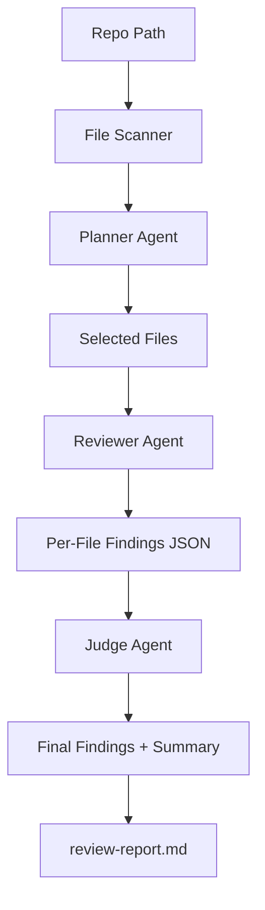

# Gemini Agentic Code Review

**Repository:** [github.com/srimani75/AICodereviewer](https://github.com/srimani75/AICodereviewer)

Clone:

```powershell
git clone https://github.com/srimani75/AICodereviewer.git
cd AICodereviewer
```

If the remote was empty when you first pushed, use `git push -u origin main` (or `master`, depending on your default branch).

---

C#/.NET console app that runs an agentic review pipeline with Gemini:

1. **Planner agent** selects risky files.
2. **Reviewer agent** inspects each selected file for defects.
3. **Judge agent** deduplicates and calibrates severity.
4. Generates a markdown report.

## Flow Diagram



## Setup

- Install .NET 8 SDK

Set your Gemini API key:

```powershell
$env:GEMINI_API_KEY="your_api_key_here"
```

## Run

```powershell
dotnet run --project .\CoveReciewDotnet\GeminiAgenticCodeReview.csproj -- --repo . --output review-report.md
```

Optional flags:

- `--model gemini-1.5-pro`
- `--max-files 40`
- `--top-files 12`
- `--max-chars-per-file 16000`

## Output

- Writes `review-report.md` with prioritized findings (critical/high/medium/low).
