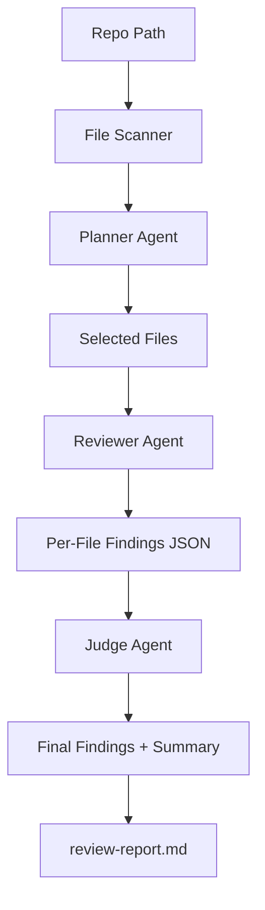

# Gemini Agentic Code Review

**Repository:** [github.com/srimani75/AICodereviewer](https://github.com/srimani75/AICodereviewer)

Clone:

```powershell
git clone https://github.com/srimani75/AICodereviewer.git
cd AICodereviewer
```

If the remote was empty when you first pushed, use `git push -u origin main` (or `master`, depending on your default branch).

---

C#/.NET console app that runs an agentic review pipeline with Gemini:

1. **Planner agent** selects risky files.
2. **Reviewer agent** inspects each selected file for defects.
3. **Judge agent** deduplicates and calibrates severity.
4. Generates a markdown report.

## Flow Diagram



## Setup

- Install .NET 10 SDK

Set your Gemini API key:

```powershell
$env:GEMINI_API_KEY="your_api_key_here"
```

## Run

```powershell
dotnet run --project .\CoveReciewDotnet\GeminiAgenticCodeReview.csproj -- --repo . --output review-report.md
```

Optional flags:

- `--model gemini-1.5-pro`
- `--max-files 40`
- `--top-files 12`
- `--max-chars-per-file 16000`

## GitHub Actions

| Workflow | Purpose |
|----------|---------|
| [`.github/workflows/ci.yml`](.github/workflows/ci.yml) | On PRs and pushes to `main`/`master`: sequential `restore` → `lint` (`dotnet format --verify-no-changes`) → `build` (Release) → `unit-test` (`dotnet test --no-build`, using build artifacts). |

**Branch protection:** Require `lint`, `build`, and `unit-test` only. Do not require a Bugbot-related GitHub check for merge—Bugbot’s review runs asynchronously on Cursor’s side and can feel slow if it gates merges.

### Cursor Bugbot (separate from Actions)

CI above runs on **every** pull request into `main` / `master` (new commits, opened/reopened, and when a draft becomes ready).

For [Cursor Bugbot](https://cursor.com/docs/bugbot), use the [Bugbot dashboard](https://cursor.com/dashboard/bugbot) and keep **automatic reviews on each PR update** enabled. Do **not** turn on **“Run only when mentioned”** (personal/team settings) if you want reviews on every MR without relying on comments.

**About `bugbot run` comments:** Bugbot is designed to also react to `bugbot run` / `cursor review` on a PR. The product does not offer a repository switch to “automatic only, ignore manual triggers.” To avoid extra runs from stray `bugbot run` comments, rely on automatic updates only and skip posting those comments on PRs (team policy). Duplicate reviews can also happen if both dashboard automation and comment triggers fire—prefer one approach.

## Output

- Writes `review-report.md` with prioritized findings (critical/high/medium/low).
